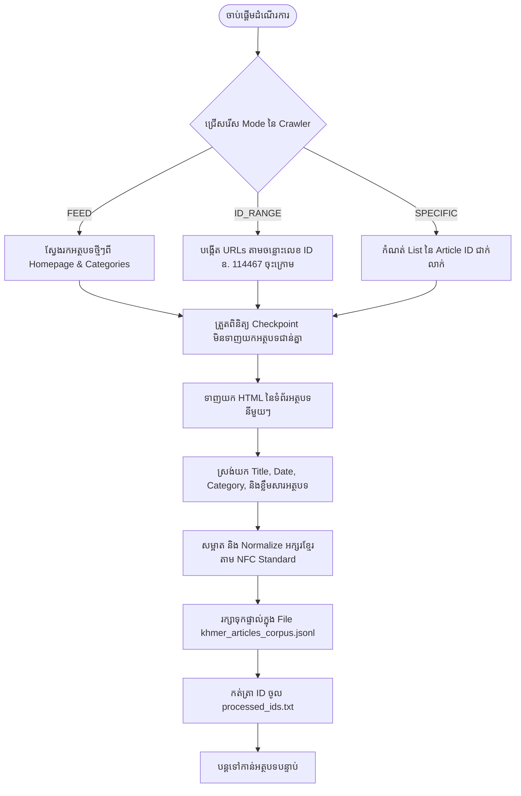

# គម្រោងប្រមូលទិន្នន័យអត្ថបទខ្មែរសម្រាប់ KHMER LLM (README)

ប្រព័ន្ធស្វ័យប្រវត្តិកម្មសម្រាប់ Crawl និងស្រង់ទិន្នន័យអត្ថបទព័ត៌មាន និងអត្ថបទច្បាប់ខ្មែរពីគេហទំព័រ (ដូចជា BTV News `https://btv.com.kh/` និងគេហទំព័រដទៃទៀត) ដោយឥតគិតថ្លៃ ១០០% មិនចាំបាច់ប្រើប្រាស់ API Key (Gemini/OpenAI) ឬ OCR ឡើយ។

លទ្ធផលអត្ថបទទាំងអស់ត្រូវបានសម្អាតតាមស្ដង់ដារ **Khmer Unicode Normalization** និងរក្សាទុកផ្ទាល់ជា File **`.jsonl`** (`extracted_texts/khmer_articles_corpus.jsonl`) សម្រាប់យកទៅប្រើប្រាស់ក្នុងការ Train/Fine-tune ម៉ូឌែល Khmer LLM ភ្លាមៗ។

---

## ១. ដ្យាក្រាមដំណើរការការងារ (Workflow Diagram)



---

## ២. មុខងារចម្បងៗ (Key Features)

- **100% Free & Fast**: ដំណើរការផ្ទាល់តាមរយៈ Web Scraping ឥតគិតថ្លៃ លឿនបំផុត និងមិនអស់ថ្លៃ Token API ឡើយ។
- **Khmer Unicode Normalizer**: ប្រព័ន្ធសម្អាតតួអក្សរខ្មែរ កម្ចាត់ស្រៈ/ព្យញ្ជនៈជាន់ដដែលៗ កែសម្រួល Spacing និង Normalize ទម្រង់ NFC ឱ្យបានត្រឹមត្រូវ ១០០%។
- **Direct JSONL Output**: រក្សាទុកផ្ទាល់ជា `khmer_articles_corpus.jsonl` (១ ជួរ = ១ អត្ថបទ) សម្រាប់ Train ឬ Fine-tune ម៉ូឌែល AI ភ្លាមៗ។
- **Smart Checkpoint**: ចងចាំលេខ ID ដែលបានធ្វើរួចក្នុង `processed_ids.txt` និង `khmer_articles_corpus.jsonl` ដើម្បីការពារការទាញយកជាន់គ្នា។


---

## ៣. រចនាសម្ព័ន្ធ Folder (Directory Structure)

```text
khmer_llm_pipeline/
├── extracted_texts/             [កន្លែងផ្ទុកទិន្នន័យស្រង់រួច]
│   ├── 114467.txt
│   ├── 114466.txt
│   └── khmer_articles_corpus.jsonl   [Corpus សរុបសម្រាប់ Train AI]
│
├── pipeline.py                  Script ស្វ័យប្រវត្តិកម្ម Crawler មេ
├── requirements.txt             បញ្ជី Libraries (requests, beautifulsoup4, tqdm)
├── run.sh                       Script សម្រាប់ដំណើរការដោយស្វ័យប្រវត្តិ
├── processed_ids.txt            File កត់ត្រា Checkpoint ការពារជាន់គ្នា
├── skipped_errors.log           File កត់ត្រាកំហុសពេលដំណើរការ
└── WORKFLOW.md                  ឯកសារដំណើរការការងារលម្អិត
```

---

## ៤. របៀបដំណើរការ (How to Run)

### របៀបទី ១៖ ដំណើរការដោយស្វ័យប្រវត្តិ (ងាយស្រួលបំផុត)
```bash
./run.sh
```

### របៀបទី ២៖ ដំណើរការដោយដៃតាម Terminal
```bash
source venv/bin/activate
pip install -r requirements.txt
python pipeline.py
```

---

## ៥. របៀបកំណត់ជម្រើស Crawl ក្នុង `pipeline.py`

បើកមើល `pipeline.py` នៅផ្នែកខាងលើ៖
- `CRAWL_MODE = "FEED"` : រុករកអត្ថបទថ្មីៗស្វ័យប្រវត្តពីគេហទំព័រ។
- `CRAWL_MODE = "ID_RANGE"` : ដាក់លេខ `START_ID = 114467` និង `END_ID = 110000` ដើម្បីទាញយកតាមលំដាប់លេខ ID។
- `MAX_ARTICLES = 50` : កំណត់ចំនួនអត្ថបទ (ឬដាក់ `None` ប្រសិនបើចង់ទាញយកទាំងអស់ឥតកំណត់)។

