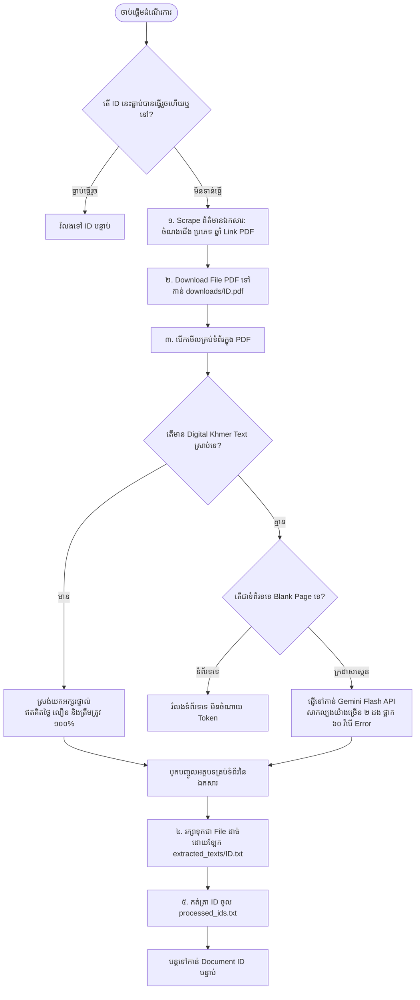

# គម្រោងប្រមូលទិន្នន័យ NCDD សម្រាប់ KHMER LLM (README)

ប្រព័ន្ធស្វ័យប្រវត្តិកម្មសម្រាប់ទាញយកឯកសារច្បាប់ និងរដ្ឋបាលពី https://library.ncdd.gov.kh/ និងបម្លែងជា File អត្ថបទខ្មែរ (.txt) មួយៗដាច់ដោយឡែកក្នុង Folder extracted_texts/ សម្រាប់យកទៅប្រើប្រាស់ក្នុងការបង្វឹក (Train) Khmer LLM។

---

## ១. ដ្យាក្រាមដំណើរការការងារពេញលេញ (Workflow Diagram)



---

## ២. ដំណាក់កាលលម្អិតទាំង ៥ នៃដំណើរការការងារ (Step-by-Step Workflow)

### ដំណាក់កាលទី ១៖ ការត្រួតពិនិត្យ Checkpoint
- ប្រព័ន្ធនឹងពិនិត្យមើលបញ្ជី ID ក្នុង File `processed_ids.txt` និង File ដែលមានស្រាប់ក្នុង `extracted_texts/`។
- ប្រសិនបើ ID ណាត្រូវបានធ្វើរួចហើយ វានឹងរំលងចោលភ្លាមៗ ដោយមិនទាញយក ឬចំណាយ Token ជាន់គ្នាឡើយ។

### ដំណាក់កាលទី ២៖ ការ Scrape ព័ត៌មាន និង Download PDF
- កូដចូលទៅកាន់ `https://library.ncdd.gov.kh/detail/{id}`។
- ស្រង់យកព័ត៌មាន៖ ចំណងជើង (Title), ប្រភេទឯកសារ (Category), ឆ្នាំចេញផ្សាយ (Year), និង Link PDF។
- Download File PDF រក្សាទុកក្នុង Folder `downloads/{id}.pdf`។

### ដំណាក់កាលទី ៣៖ ការស្រង់យកអត្ថបទខ្មែរឆ្លាតវៃ (Smart Extraction)
សម្រាប់ទំព័រនីមួយៗនៃ PDF៖
- **ពិនិត្យ Digital Text**៖ បើជា PDF ដែល Export ចេញពី Word មានអក្សរខ្មែរស្រាប់ វានឹងស្រង់យកផ្ទាល់ភ្លាមៗក្នុងរយៈពេល ០.១ វិនាទី (Free)។
- **ពិនិត្យទំព័រទទេ**៖ បើជាទំព័រទទេ វានឹងរំលងចោលភ្លាម (០ Token)។
- **ក្រដាសស្កេនរូបភាព**៖ វានឹងបញ្ជូនរូបភាពទំព័រទៅកាន់ **Gemini Flash API** ដើម្បីអានជើងអក្សរ និងតារាងឱ្យបានត្រឹមត្រូវ ១០០% (សាកល្បងយ៉ាងច្រើន ២ ដង និងផ្អាក ៦០ វិនាទីបើមាន Error)។

### ដំណាក់កាលទី ៤៖ ការរក្សាទុកជា File ដាច់ដោយឡែក (Individual .txt Storage)
- រាល់អត្ថបទដែលស្រង់បាននៃឯកសារនីមួយៗ នឹងត្រូវរក្សាទុកក្នុង File មួយដាច់ដោយឡែក៖ `extracted_texts/{id}.txt`។
- ក្នុង File នីមួយៗមានក្បាលព័ត៌មានច្បាស់លាស់៖
  - Document ID (លេខសម្គាល់)
  - Title (ចំណងជើង)
  - Category (ប្រភេទឯកសារ)
  - Year (ឆ្នាំចេញផ្សាយ)
  - Source URL (ប្រភព Link)
  - Content (ខ្លឹមសារអត្ថបទខ្មែរពេញលេញ)

### ដំណាក់កាលទី ៥៖ ការកត់ត្រា Checkpoint និងបន្តទៅមុខ
- កត់ត្រាលេខ ID ចូលក្នុង `processed_ids.txt`។
- ដំណើរការរត់ស្វ័យប្រវត្តិតាម Loop ទៅកាន់ ID បន្ទាប់រហូតដល់ចប់។

---

## ៣. រចនាសម្ព័ន្ធ Folder (Directory Structure)

```text
khmer_llm_pipeline/
├── downloads/                   [កន្លែងផ្ទុកបណ្ដោះអាសន្ន] File PDF ដើមពី NCDD
│   ├── 17235.pdf
│   ├── 17236.pdf
│   └── 17237.pdf
│
├── extracted_texts/             [កន្លែងផ្ទុកលទ្ធផលចុងក្រោយ] File .txt មួយៗដាច់ដោយឡែក
│   ├── 17235.txt
│   ├── 17236.txt
│   └── 17237.txt
│
├── pipeline.py                  Script ស្វ័យប្រវត្តិកម្មចម្បង
├── requirements.txt             បញ្ជី Libraries
├── run.sh                       Script សម្រាប់ដំណើរការ venv ដោយស្វ័យប្រវត្តិ
├── processed_ids.txt            File កត់ត្រា Checkpoint
└── skipped_errors.log           File កត់ត្រាកំហុស
```

---

## ៤. របៀបដំណើរការក្នុង VS Code Terminal ជាមួយ venv

### របៀបទី ១៖ ដំណើរការដោយស្វ័យប្រវត្តិតាម run.sh (ណែនាំឱ្យប្រើ)
```bash
./run.sh
```

### របៀបទី ២៖ ដំណើរការតាមជំហានដោយដៃ
```bash
source venv/bin/activate
export GEMINI_API_KEY="YOUR_ACTUAL_GEMINI_API_KEY"
python pipeline.py
```
