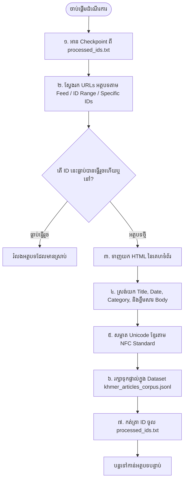

# ដំណើរការការងារប្រព័ន្ធប្រមូលទិន្នន័យអត្ថបទខ្មែរ (WORKFLOW.MD)

ឯកសារនេះរៀបរាប់អំពីដំណើរការការងារពេញលេញ (End-to-End Workflow) នៃប្រព័ន្ធ Crawl និងស្រង់ទិន្នន័យអត្ថបទព័ត៌មាន និងអត្ថបទច្បាប់ពីគេហទំព័រ (ដូចជា BTV News `btv.com.kh`) ទៅជា File អត្ថបទខ្មែរ (.jsonl) ស្អាត គ្មានបញ្ហាខូចតួអក្សរ សម្រាប់យកទៅប្រើប្រាស់ក្នុងការបង្វឹក (Train) Khmer LLM។

---

## ១. ដ្យាក្រាមដំណើរការការងារ (Workflow Diagram)



---

## ២. ដំណាក់កាលលម្អិតទាំង ៥ នៃដំណើរការការងារ

### ដំណាក់កាលទី ១៖ ការត្រួតពិនិត្យ Checkpoint
- ប្រព័ន្ធនឹងពិនិត្យមើលបញ្ជី ID ក្នុង File `processed_ids.txt` និង `khmer_articles_corpus.jsonl`។
- រាល់អត្ថបទណាដែលធ្លាប់បានស្រង់រួច វានឹងរំលងចោលភ្លាមៗ ដើម្បីកុំឱ្យខាតពេលវេលា និងមិនឱ្យមានទិន្នន័យស្ទួន។

### ដំណាក់កាលទី ២៖ ការស្វែងរក និងទាញយកគេហទំព័រ (Web Crawling)
- គាំទ្រ ៣ ជម្រើសធំៗ៖
  1. `FEED`: រុករកអត្ថបទថ្មីៗពីទំព័រដើម និង Categories ដោយស្វ័យប្រវត្តិ។
  2. `ID_RANGE`: ទាញយកតាមលំដាប់លេខ ID (ឧ. ពី `114467` ថយចុះដល់ `110000`)។
  3. `SPECIFIC`: កំណត់តែ ID ជាក់លាក់ដែលចង់តេស្ត។

### ដំណាក់កាលទី ៣៖ ការស្រង់ទិន្នន័យ HTML (HTML Parsing)
- ស្រង់យកព័ត៌មានលម្អិត៖
  - **ចំណងជើង (Title)**
  - **កាលបរិច្ឆេទចេញផ្សាយ (Publish Date & Time)**
  - **ប្រភេទព័ត៌មាន (Category)**
  - **ខ្លឹមសារពេញលេញ (Full Article Body Text)** (លុបពាណិជ្ជកម្ម Ads, Scripts, និងប៊ូតុង Share ចោលស្អាត)

### ដំណាក់កាលទី ៤៖ ការសម្អាតអក្សរខ្មែរ (Khmer Unicode Normalization)
- កម្ចាត់ស្រៈ និងព្យញ្ជនៈជាន់ដដែលៗ
- ភ្ជាប់ពាក្យដែលដាច់ដោយសារ Newline
- រៀបចំចន្លោះឃ្លា (Spacing) ឱ្យត្រឹមត្រូវ
- ធានាស្ដង់ដារ **Unicode NFC** ត្រឹមត្រូវ ១០០% សម្រាប់ LLM Tokenizer

### ដំណាក់កាលទី ៥៖ ការរក្សាទុកទិន្នន័យ (Direct JSONL Storage)
- រក្សាទុកផ្ទាល់ជា ១ ជួរក្នុង File `extracted_texts/khmer_articles_corpus.jsonl`
- កត់ត្រា ID ចូលក្នុង `processed_ids.txt`


---

## ៣. របៀបដំណើរការក្នុង Terminal

```bash
cd /Users/user/Downloads/khmer_llm_pipeline
./run.sh
```

